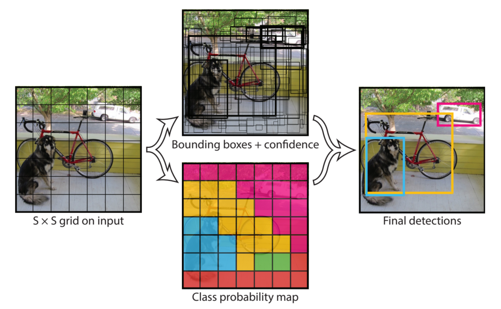
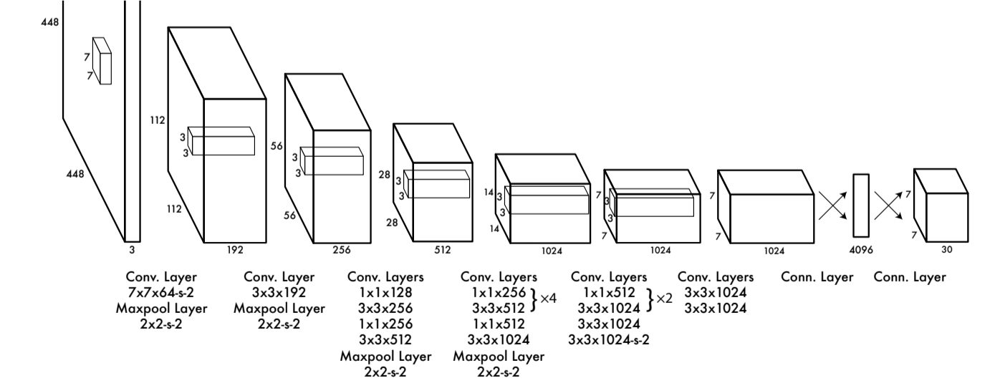
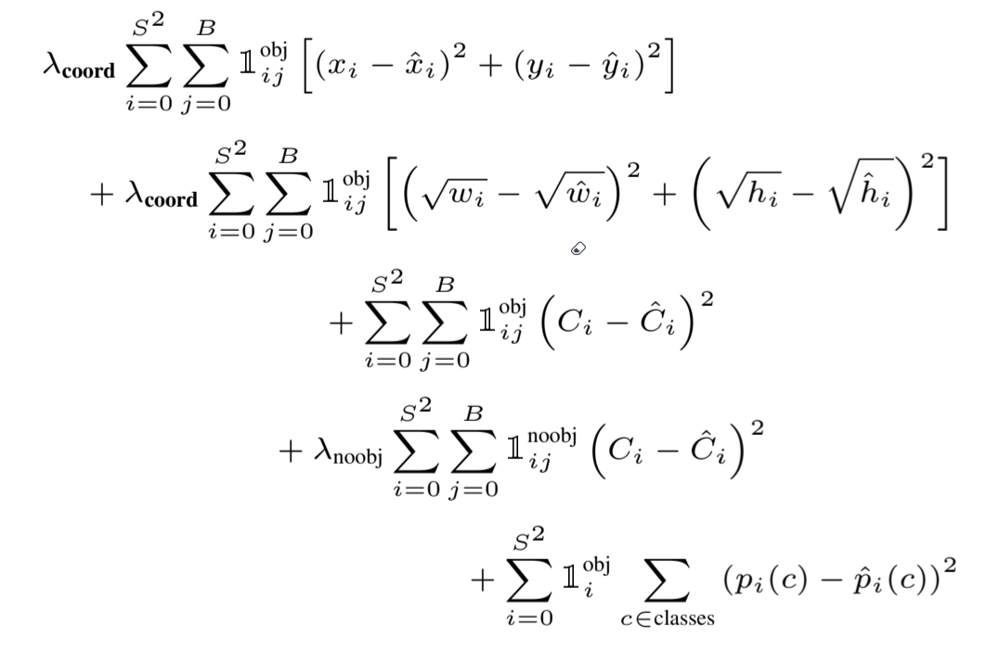
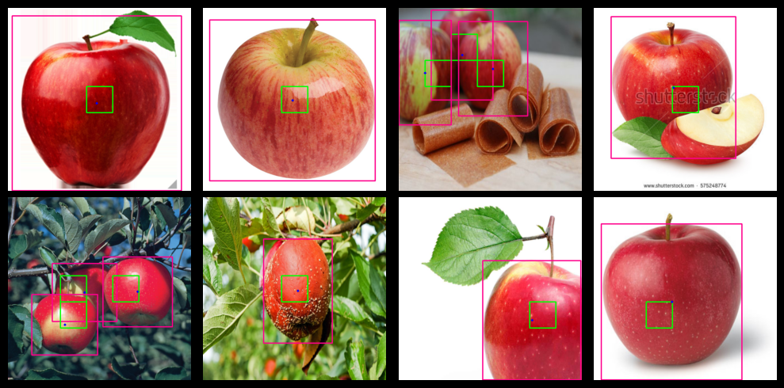

---

# YOLO-from-scratch



## Overview

**YOLOv1 (You Only Look Once)** is a groundbreaking approach for real-time object detection. Unlike traditional methods, YOLOv1 divides the image into a grid and predicts bounding boxes and class probabilities directly from the full image in a single forward pass.
****
This implementation is inspired by the seminal paper:

> *You Only Look Once: Unified, Real-Time Object Detection*  
> Joseph Redmon, Santosh Divvala, Ross Girshick, Ali Farhadi  
> [Link to paper](https://arxiv.org/abs/1506.02640)

This repository provides a PyTorch-based implementation of YOLOv1, with a custom convolutional backbone and loss function. It also leverages OpenCV for preprocessing and visualization.

---

## Key Features

- **Custom Convolutional Backbone**:  
  Implements a convolutional neural network (CNN) with Batch Normalization and pooling layers to extract features efficiently from images.

- **Fully Connected Prediction Layers**:  
  Includes dense layers to predict bounding boxes, object confidence scores, and class probabilities for each grid cell.

- **YOLO Loss Function**:  
  Combines coordinate regression loss, confidence loss, and classification loss, weighted according to the paper's recommendations.

---

## Architecture Highlights




### Convolutional Backbone

The `ConvLayers` class extracts image features using a series of convolutional, Batch Normalization, and pooling layers. Here's a simplified overview:

```python
class ConvLayers(nn.Module):
    def __init__(self):
        super().__init__()
        self.conv1 = nn.Conv2d(in_channels=3, out_channels=192, kernel_size=7, stride=2, padding=3)  
        self.bn1 = nn.BatchNorm2d(192)
        self.maxpool1 = nn.MaxPool2d(kernel_size=2, stride=2)
        
        self.conv2 = nn.Conv2d(in_channels=192, out_channels=256, kernel_size=3, padding=1)  
        self.bn2 = nn.BatchNorm2d(256)
        self.maxpool2 = nn.MaxPool2d(kernel_size=2, stride=2)
        
        self.conv3 = nn.Sequential(
            nn.Conv2d(in_channels=256, out_channels=128, kernel_size=1),
            nn.BatchNorm2d(128),
            nn.Conv2d(in_channels=128, out_channels=256, kernel_size=3, padding=1),  
            nn.BatchNorm2d(256),
            nn.Conv2d(in_channels=256, out_channels=256, kernel_size=1),
            nn.BatchNorm2d(256),
            nn.Conv2d(in_channels=256, out_channels=512, kernel_size=3, padding=1),
            nn.BatchNorm2d(512)
        )
        ...

    def forward(self, x):
        x = self.maxpool1(F.leaky_relu(self.conv1(x)))
        x = self.maxpool2(F.leaky_relu(self.conv2(x)))
        x = self.maxpool3(F.leaky_relu(self.conv3(x)))
        x = self.maxpool4(F.leaky_relu(self.conv4(x)))
        x = F.leaky_relu(self.conv5(x))
        x = F.leaky_relu(self.conv6(x))
        return x
```

### Fully Connected Layers

The `FCLayers` class predicts bounding box coordinates, confidence scores, and class probabilities for each grid cell:

```python
class FCLayers(nn.Module):
    def __init__(self, S, B, C):
        super().__init__()
        self.fc1 = nn.Linear(S * S * 1024, 4096)
        self.fc2 = nn.Linear(4096, S * S * (B * 5 + C))
```

- **Outputs**: A tensor reshaped to `(S, S, B * 5 + C)`:
  - `B * 5` includes bounding box coordinates and confidence scores.
  - `C` represents class probabilities.

### YOLOv1 Model

The `YOLOv1` class combines the convolutional backbone and fully connected layers:

```python
class YOLOv1(nn.Module):
    def __init__(self, S=7, B=2, C=20):
        super().__init__()
        self.convLayers = ConvLayers()
        self.fcLayers = FCLayers(S, B, C)

    def forward(self, x):
        x = self.convLayers(x)
        x = self.fcLayers(x)
        x = x.view(-1, S, S, B * 5 + C)
        return x
```

---

## Loss Function




The custom loss **function** calculates three components:

1. **Bounding Box Loss**: Penalizes differences in predicted box coordinates (`x, y, w, h`).
2. **Confidence Loss**: Ensures confidence scores match the presence of objects.
3. **Classification Loss**: Measures cross-entropy for class probabilities.

Key implementation snippet:

```python
def loss_fn(self, predictions, targets):
    pred_bboxes, pred_confs, pred_classes, _ = self.destruct(predictions)
        true_bboxes, true_confs, true_classes, _ = self.destruct(targets)

        iou = self.findIOU(pred_bboxes, true_bboxes)
        best_iou_mask = self.get_best_iou_mask(iou)

        obj_mask = true_confs > 0 
        no_obj_mask = ~obj_mask   

        responsible_mask = torch.zeros_like(pred_confs, dtype=torch.bool)
        responsible_mask.scatter_(-1, best_iou_mask, 1)

        xy_loss = F.mse_loss(
            pred_bboxes[..., :2][obj_mask & responsible_mask],
            true_bboxes[..., :2][obj_mask & responsible_mask],
            reduction='sum'
        )
        wh_loss = F.mse_loss(
            torch.sqrt(torch.clamp(pred_bboxes[..., 2:4][obj_mask & responsible_mask], min=1e-6)),
            torch.sqrt(torch.clamp(true_bboxes[..., 2:4][obj_mask & responsible_mask], min=1e-6)),
            reduction='sum'
        )

        bbox_loss = self.coord_scale * (xy_loss + wh_loss)

        obj_conf_loss = F.mse_loss(
            pred_confs[obj_mask & responsible_mask],
            true_confs[obj_mask & responsible_mask],
            reduction='sum'
        )
        
        no_obj_conf_loss = F.mse_loss(
            pred_confs[no_obj_mask],
            true_confs[no_obj_mask],
            reduction='sum'
        )
        conf_loss = obj_conf_loss + self.noobj_scale * no_obj_conf_loss

        grid_obj_mask = obj_mask.any(dim=-1)

        class_loss = F.mse_loss(
            pred_classes[grid_obj_mask],
            true_classes[grid_obj_mask],
            reduction='sum'
        )

        total_loss = bbox_loss + conf_loss + class_loss
        return total_loss / predictions.shape[0] 
```

---

## Examples

### Training Pipeline

1. Prepare datasets with bounding box annotations.
2. Use a pre-trained `ConvLayers` model for feature extraction (optional).
3. Fine-tune the full YOLOv1 model for object detection tasks.

### Results

Sample detection output:  


---

## References

- **Original Paper**: [YOLOv1 on arXiv](https://arxiv.org/abs/1506.02640)

---